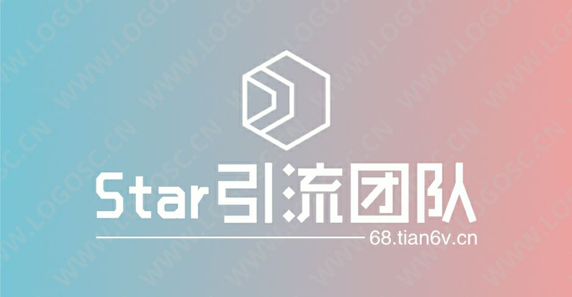

<div align="center">
  
  <h1>SkyLearn · 在线教育业务中枢与智能分流分销平台</h1>
  <p>企业级多货源聚合分发 · 高可靠状态机异步调度引擎 · Vue 3 + TypeScript 现代化纯单页管理后台</p>

  <p>
    <a href="https://vuejs.org/"></a>
    <a href="https://www.typescriptlang.org/"></a>
    <a href="https://vitejs.dev/"></a>
    <a href="https://www.naiveui.com/"></a>
    <a href="https://www.php.net/"></a>
    <a href="https://www.mysql.com/"></a>
    <a href="./LICENSE"></a>
  </p>
</div>

---

## 📖 项目简介

**SkyLearn（云学）** 是一套面向多货源聚合、在线下单查课、自动化队列流转与多级分销代理的综合性商业业务平台。

项目由传统多页 PHP/Layui 架构**彻底重构而来**。在保留既有高并发业务内核与复杂外部平台串货协议的基础上，前端升级为基于 **Vue 3 + TypeScript + Vite + Naive UI** 的现代化全自适应 SPA；后端构建了**统一的安全 API 网关与自研任务调度引擎**，彻底解决了传统轮询脚本卡死、移动端交互体验差、接口链路黑盒等生产痛点。

---

## 🏛️ 系统架构设计

```text
┌─────────────────────────────────────────────────────────────────────────────┐
│                             客户端展现层 (Clients)                            │
│    PC 桌面端运营管理后台    │    移动端 H5 响应式自适应    │    第三方商户 API 对接   │
└───────────────────────┬───────────────────────────────────┬─────────────────┘
                        │ HTTPS (Vite SPA History 路由)       │ JSON / Form
                        ▼                                   ▼
┌─────────────────────────────────────────────────────────────────────────────┐
│                             API 网关与安全层                                │
│       Nginx 动静分离 & 缓存渗透防御  │  CSRF Token 动态校验与同源约束机制        │
│       RBAC 动态权限拦截器          │  APM 全链路打点日志与敏感数据自动脱敏掩码      │
└───────────────────────┬───────────────────────────────────┬─────────────────┘
                        │                                   │
                        ▼                                   ▼
┌──────────────────────────────────────┐  ┌───────────────────────────────────┐
│     现代化管理后台服务 (admin-api/v1)  │  │      对外开放网关与协议适配 (api.php)  │
│  - 用户资产与费率矩阵计算               │  - 小储/发卡网多协议自适应解析       │
│  - 订单实时检索、批量改价与售后工单     │  - 在线查课、异步交单、进度回传       │
│  - 货源智能路由与上游健康度探活         │  - 平台串货互通与双向对账校验         │
└──────────────────┬───────────────────┘  └─────────────────┬─────────────────┘
                   │                                        │
                   ▼                                        ▼
┌─────────────────────────────────────────────────────────────────────────────┐
│                     核心业务引擎与任务工作流 (Engine Core)                     │
│  ┌─────────────────────────┐  ┌─────────────────────────┐  ┌──────────────┐ │
│  │ 活跃订单状态机同步引擎   │  │ 异步自动出单交付引擎   │  │ 慢速巡检引擎 │ │
│  └─────────────────────────┘  └─────────────────────────┘  └──────────────┘ │
│                轻量无依赖调度器 (scheduler_worker.php) · 事务原子锁保证         │
└──────────────────────────────────────┬──────────────────────────────────────┘
                                       │
                                       ▼
┌─────────────────────────────────────────────────────────────────────────────┐
│                              数据与持久化层 (Storage)                        │
│         MySQL 5.7+ 关系型核心库 (47 张表无损映射)   │   多级本地与云端备份容灾  │
└─────────────────────────────────────────────────────────────────────────────┘
```

---

## ⚡ 核心技术亮点与重构实践

### 1. 现代化 SPA 单页架构平滑无缝重构
- **技术突破**：系统拥有 47 个复杂业务页面，原系统大量使用 iframe 嵌套与服务端直出。重构时基于 **SoybeanAdmin + Naive UI** 构建全新现代化前端，通过 Nginx 对 `/index/` 进行精细的 SPA History Fallback 重写，**在完全保持原有 47 个生产业务路由不变、用户无感切换的前提下**，实现了 100% 现代前端现代化蜕变。
- **类型安全**：全面接入 TypeScript 5 严格模式，为 38+ 业务模型定义接口契约，消除了过去 PHP 弱类型导致的隐性字段不匹配。

### 2. 自研数据库状态机异步调度引擎（告别臃肿中间件）
- **痛点解决**：很多云服务器由于缺少特定扩展或内存受限，常导致基于外挂 Redis 的常驻死循环脚本意外中断。
- **自研实现**：在 `admin-api/v1/scheduler_worker.php` 中实现了轻量级**基于 MySQL 行级锁与状态机模型**的任务驱动引擎，将调度任务解耦为：
  - `progress_active`（高频活跃同步引擎，自动纳入补刷重刷订单，精准统计互斥独立订单数）
  - `auto_ship`（高并发批量交单引擎）
  - `slow_inspect`（低频平时分巡检引擎）
  - `auto_prune`（日志自动瘦身与空间清理引擎）
- **成效**：前端呈现为黑客极客视窗，支持独立启停开关、自定义运行周期、单任务一键运行与实时终端日志输出，仅需一条 Crontab 指令即可稳定高可用运行。

### 3. APM 全链路接口监控与报文审计中心
- **全链路可视**：构建“对接监控”与“操作日志”双重视窗，支持双向流量监控（外部对接我 / 我对接外部），记录毫秒级耗时、HTTP 状态与入出向网络流量（Byte/KB 精确统计）。
- **极客双视图**：提供“常规数据表格”与“运维流终端模式 (Terminal Stream)”双视图秒级切换。
- **敏感信息自动脱敏**：引入原生 `<NCode>` 代码着色抽屉，实时对报文中的学员密码、支付秘钥进行正则掩码脱敏，兼顾运维排障与数据安全。

### 4. Nginx 生产环境缓存穿透与多端标准化自适应治理
- **前端缓存治理**：针对 Vite 生产构建产物，在 Nginx 层面严格配置 HTML 入口与 SPA fallback 路由 `no-cache, no-store, must-revalidate`，同时对带哈希的 `/assets/` 静态分包开启 `immutable` 强缓存，彻底根治浏览器 304 强缓存导致的代码不更新与 Chunk 加载慢蓝条问题。
- **移动端全量自适应**：对全站 10 个核心数据表格（工单、订单、日志、卡密等）底部分页栏进行标准化改造，接入响应式断点，小屏自动收敛为 5 槽位紧凑型规格，消除手机端页码裁切与文字挤压。

---

## 📂 仓库目录规范

```text
SkyLearn/
├── admin-api/                 # 统一后端 RESTful API 服务层
│   └── v1/                    # v1 版本接口中心与任务调度工作流
├── admin-web/                 # 现代化前端工程 (Vue 3 + TS + Vite + NaiveUI)
│   ├── src/
│   │   ├── views/             # 47 个全量业务视图页面
│   │   ├── router/            # 路由定义与权限守卫
│   │   ├── store/             # Pinia 状态管理
│   │   └── service/           # API 统一请求封装与类型定义
│   ├── vite.config.ts         # Vite 现代化原子构建配置
│   └── package.json           # 前端依赖配置
├── Checkorder/                # 第三方货源适配器与解析脚本
├── confing/                   # 核心基础配置文件与 APM 打点引擎
├── cron/                      # 传统轮询与计划任务脚本
├── epay/                      # 支付网关对接与异步回调安全验证
├── index/                     # 经典服务端渲染页面与路由适配
├── xm/                        # 系统数据核心配置目录
├── api.php                    # 开放 API 统一对外服务网关入口
├── apisub.php                 # 经典业务下单核心处理接口
├── xm.sql                     # 数据库初始结构与全量表定义 (47 张表)
└── README.md                  # 项目工程技术文档
```

---

## 🚀 本地开发与快速上手

### 1. 运行依赖
- **后端环境**：PHP 7.4+（推荐搭配 cURL, OpenSSL, PDO_MySQL, JSON 扩展）
- **数据库**：MySQL 5.7+ / MariaDB 10.4+
- **前端环境**：Node.js >= 18.0.0, pnpm >= 8.0.0

### 2. 数据库与后端初始化
1. 创建数据库 `skylearn` 并导入基础建表脚本 `xm.sql`：
   ```bash
   mysql -u root -p skylearn < xm.sql
   ```
2. 修改 `confing/config.php` 与 `xm/config.php` 中的数据库连接参数与安全凭证。
3. 配置 Web 服务器（Nginx 推荐配置）：
   ```nginx
   location /index/ {
       try_files $uri $uri/ /index/index.html;
   }
   ```

### 3. 前端编译与热更新调试
```bash
# 进入前端源码目录
cd admin-web

# 安装依赖
pnpm install

# 启动本地开发热重载服务器
pnpm dev

# 执行生产级打包
pnpm build
```

---

## 🛡️ 安全合规与技术声明

1. **凭证脱敏安全**：本开源仓库已进行严格的代码审计与敏感凭证剥离，数据库连接参数均使用占位符，严禁将生产商户秘钥、服务器私钥提交至公共代码库。
2. **免责与合规**：本项目架构源码仅供计算机科学工程实践、全栈架构重构、代码学习与求职技术交流展示，严禁用于任何违反相关法律法规的非法用途。

---

## 📄 开源许可证
本项目遵循 [MIT License](./LICENSE) 协议开源。
